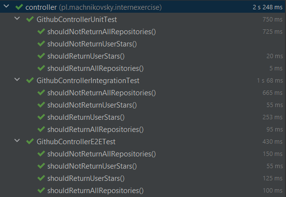

# Allegro software engineer intern exercise
The main goal of the exercise is to make an application, that allows you to list GitHub repositories of specified users (names and stars) and to get the total number of stars of a certain user. This data is supposed to be retrieved via HTTP protocol.

## Table of contents
- [How to run application](#how-to-run-application)
  * [JAR file](#jar-file)
  * [Docker](#docker)
    + [Dockerfile](#dockerfile)
    + [Dockerhub](#dockerhub)
- [About an application](#about-an-application)
  * [Endpoints](#endpoints)
  * [Exceptions](#exceptions)
  * [Tests](#tests)
- [Technologies used](#technologies-used)


## How to run application 

There are few ways to run that application. The first one is to just clone a repository, open it in IDE and run, so I'm not going to explain it any farther. Instead, I'll explain how to run application from generated JAR file and by Docker.

### JAR file

1. Clone repository and move to the cloned directory
```
$ git clone https://github.com/machnikovsky/allegro-software-engineer-intern-exercise.git
$ cd ./allegro-software-engineer-intern-exercise
```

2. Generate JAR file by Maven. Make sure you have Maven downloaded and added to PATH. This will create a folder './target' and JAR file inside of it.
```
$ mvn install
```
3. Run JAR file. Make sure second step succeeded and make sure you have JDK installed and added to the PATH.
```
$ java -jar .\target\internexercise-0.0.1-SNAPSHOT.jar
```

### Docker

For this option you have to have Docker installed. You can either do it by Dockerfile that is inside this repository, or download an image from Dockerhub. I will explain both options.

#### Dockerfile

1. Clone repository and move to the cloned directory
```
$ git clone https://github.com/machnikovsky/allegro-software-engineer-intern-exercise.git
$ cd ./allegro-software-engineer-intern-exercise
```
2. Generate JAR file by Maven. Make sure you have Maven downloaded and added to PATH. This will create a folder './target' and JAR file inside of it.
```
$ mvn install
```
3. Build a Docker image. The tag name is up to you, but if you name it any different, make sure to use that name in a next step.
```
$ docker build -t allegro-intern-exercise:1 .
```
4. Make sure Docker image was created.
```
$ docker images
```
5. Run a Docker container. '-d' flag stands for detached, so if you want to see logs, just remove it. '-p' stands for port, so you specify here via which port you want to communicate with container. 8080 after semicolon is exposed port, so you can't change it, but you can change the first port and talk to container with the specified port. If you named your image any different, use the name you used in step 3.
```
$ docker run -d -p 8080:8080 allegro-intern-exercise:1
```

#### Dockerhub

1. Pull the image from Dockerhub.
```
$ docker pull machnikovsky/allegro-intern-exercise:latest
```
2. Run a Docker container. '-d' flag stands for detached, so if you want to see logs, just remove it. '-p' stands for port, so you specify here via which port you want to communicate with container. 8080 after semicolon is exposed port, so you can't change it, but you can change the first port and talk to container with the specified port.
```
$ docker run -d -p 8080:8080 machnikovsky/allegro-intern-exercise:latest
``` 


## About an application

### Endpoints
Application has two main endpoints, through which user can get certain data. They are

- '/repos/{user}' - returns list of repositories of a specified in '{user}' place user. They are returned in a form of JSON with two keys: name and stars.
- '/stars/{user}' - returns the total number of stars of a specified in '{user}' place user. They are returned in a form of a single value.

### Exceptions

There are three classes for handling exception. The main reason, why exception would be thrown, is providing the username that does not exist.

- GithubUserNotFoundException - a class extending RuntimeException. Made for situation, where user is not found. We specify username in constructor, and specified message is created in that constructor, so we can show client exactly what happend.

- GithubUserNotFoundEntity - a class we're going to wrap all the neccessary information into and return to the client.

- GithubExceptionHandler - a class that tells Spring how to handle certain excaption. In this case, when GithubUserNotFoundException is thrown, ResponseEntity with GithubUserNotFoundEntity object and 404 status code is returned.


### Tests

There are two type of tests: Integration tests and E2E tests. They basically test, whether at certain endpoints client get correct data, and when client provides invalid username, whether correct client gets correct response. E2E tests put the whole Spring Context and run application on random port, so they take a bit longer.



## Technologies used 

- **Java** - The main programming language of the project.
- **Spring Boot** - The backbone of the project is Spring Boot application responsible for fetching data from GitHub API and extracting only required information from recieved JSON. 
- **React** - There is also a React app with really simple UI, so you can test Spring API easily. \
- **Docker** - Both Spring and React apps can be run by Docker, seperately (by Dockerfiles) and together (by Docker Compopse), so you can build your image of the application and run it in a Docker container. 
- **GSON** - The library I used for working with JSONs.
- **JUnit & Mockito** - Libraries I used for test purposes.
