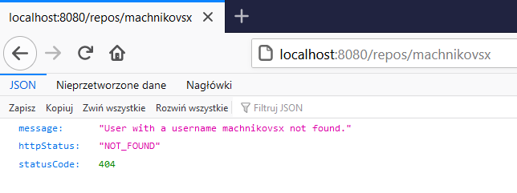
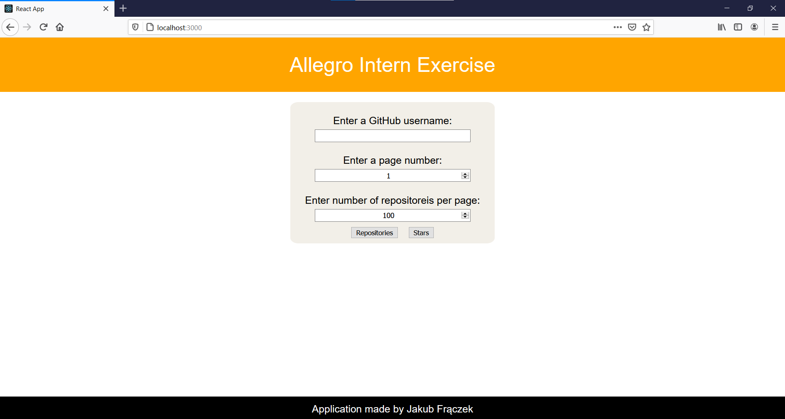
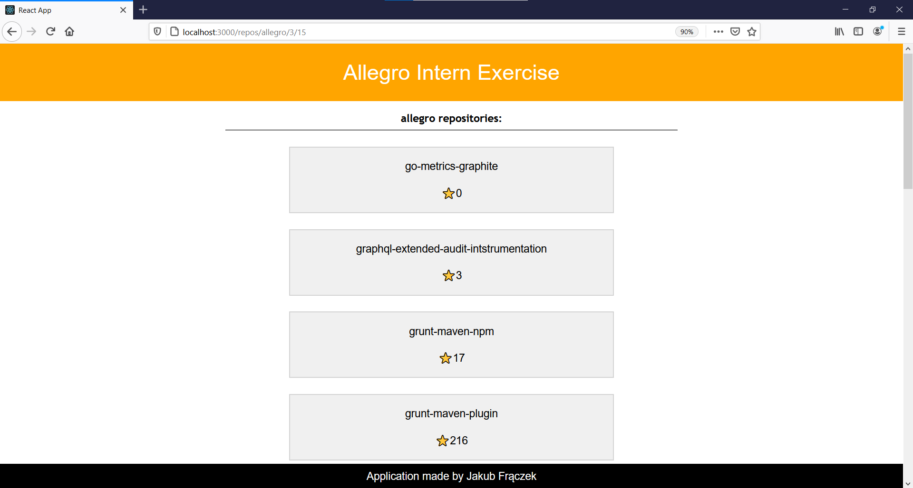
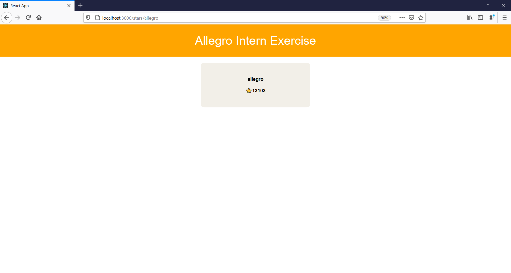

# Allegro software engineer intern exercise
The main goal of the exercise is to make an application, that allows you to list GitHub repositories of specified users (names and stars) and to get the total number of stars of a certain user. This data is supposed to be retrieved via HTTP protocol.

**Application is available live [here].**

[here]: http://www.zajavva.pl/

## Table of contents
- [How to run](#how-to-run)
  * [`Whole project`](#-whole-project-)
    + [- Docker Compose](#--docker-compose)
  * [`Spring Boot application`](#-spring-boot-application-)
    + [- JAR file](#--jar-file)
    + [- Dockerfile](#--dockerfile)
    + [- Dockerhub](#--dockerhub)
  * [`React application`](#-react-application-)
    + [- NPM](#--npm)
    + [- Dockerfile](#--dockerfile-1)
    + [- Dockerhub](#--dockerhub-1)
- [About an application](#about-an-application)
  * [Endpoints](#endpoints)
  * [Pagination](#pagination)
  * [Exceptions](#exceptions)
  * [Tests](#tests)
  * [Frontend](#frontend)
- [Technologies used](#technologies-used)
- [Further development ideas](#further-development-ideas)
- [Note to the recruiter](#note-to-the-recruiter)


## How to run 

The whole project consists of Spring backend and React frontend. They can be run separately and together, so I will cover all the scenarios.

### `Whole project`

#### - Docker Compose

**For this option, make sure you have Docker installed.**

1. Clone repository and move to the cloned directory. Build jar file.
```
$ git clone https://github.com/machnikovsky/allegro-software-engineer-intern-exercise.git
$ cd ./allegro-software-engineer-intern-exercise
$ mvn clean install
```
In case request limit has been exceeded, add a flag to skip tests, so last command would be 'mvn install -DskipTests'.

2. Run docker compose command. It will run both Spring and React application. Spring application will be available at port 8080, while React application will be available at port 3000.
```
$ docker-compose up
``` 

### `Spring Boot application`

#### - JAR file

1. Clone repository and move to the cloned directory
```
$ git clone https://github.com/machnikovsky/allegro-software-engineer-intern-exercise.git
$ cd ./allegro-software-engineer-intern-exercise
```

2. Generate JAR file by Maven. Make sure you have Maven downloaded and added to PATH. This will create a folder './target' and JAR file inside of it.
```
$ mvn clean install
```
In case request limit has been exceeded, add a flag to skip tests, so last command would be 'mvn install -DskipTests'.

3. Run JAR file. Make sure second step succeeded and that you have JDK installed and added to the PATH.
```
$ java -jar ./target/internexercise-0.0.1-SNAPSHOT.jar
```


#### - Dockerfile

**For this option, make sure you have Docker installed.**

1. Clone repository and move to the cloned directory
```
$ git clone https://github.com/machnikovsky/allegro-software-engineer-intern-exercise.git
$ cd ./allegro-software-engineer-intern-exercise
```
2. Generate JAR file by Maven. Make sure you have Maven downloaded and added to PATH. This will create a folder './target' and JAR file inside of it.
```
$ mvn install
```
In case request limit has been exceeded, add a flag to skip tests, so last command would be 'mvn install -DskipTests'.

3. Build a Docker image. The tag name is up to you, but if you name it any different, make sure to use that name in a next step.
```
$ docker build -t allegro-intern-exercise:1 .
```
4. Make sure Docker image was created.
```
$ docker images
```
5. Run a Docker container. '-d' flag stands for detached, so if you want to see logs, just remove it. '-p' stands for port, so you specify here via which port you want to communicate with container. 8080 after semicolon is exposed port, so you can't change it, but you can change the first port and talk to container with the specified port. If you named your image any different, use the name you used in step 3.
```
$ docker run -d -p 8080:8080 allegro-intern-exercise:1
```

#### - Dockerhub

**For this option, make sure you have Docker installed.**

1. Pull the image from Dockerhub.
```
$ docker pull machnikovsky/allegro-intern-exercise:latest
```
2. Run a Docker container. '-d' flag stands for detached, so if you want to see logs, just remove it. '-p' stands for port, so you specify here via which port you want to communicate with container. 8080 after semicolon is exposed port, so you can't change it, but you can change the first port and talk to container with the specified port.
```
$ docker run -d -p 8080:8080 machnikovsky/allegro-intern-exercise:latest
``` 

### `React application`

#### - NPM

**For this option, make sure you have Node installed.**

1. Clone repository and move to the cloned directory of React application.
```
$ git clone https://github.com/machnikovsky/allegro-software-engineer-intern-exercise.git
$ cd ./allegro-software-engineer-intern-exercise/react-frontend
```
2. Run the application by npm. This will run application on port 3000.
```
$ npm run start
```

#### - Dockerfile

**For this option, make sure you have Docker installed.**

1. Clone repository and move to the cloned directory of React application.
```
$ git clone https://github.com/machnikovsky/allegro-software-engineer-intern-exercise.git
$ cd ./allegro-software-engineer-intern-exercise/react-frontend
```
2. Build a Docker image. The tag name is up to you, but if you name it any different, make sure to use that name in a next step.
```
$ docker build -t allegro-react:1 .
```
3. Make sure Docker image was created.
```
$ docker images
```
5. Run a Docker container. '-d' flag stands for detached, so if you want to see logs, just remove it. '-p' stands for port, so you specify here via which port you want to communicate with container. 3000 after semicolon is exposed port, so you can't change it, but you can change the first port and talk to container with the specified port. If you named your image any different, use the name you used in step 2.
```
$ docker run -d -p 3000:3000 allegro-react:1
```


#### - Dockerhub

**For this option, make sure you have Docker installed.**

1. Pull the image from Dockerhub.
```
$ docker pull machnikovsky/allegro-react:latest
```
2. Run a Docker container. '-d' flag stands for detached, so if you want to see logs, just remove it. '-p' stands for port, so you specify here via which port you want to communicate with container. 3000 after semicolon is exposed port, so you can't change it, but you can change the first port and talk to container with the specified port.
```
$ docker run -d -p 3000:3000 machnikovsky/allegro-react:latest
``` 


## About an application

### Endpoints
Application has three main endpoints, through which user can get certain data. They are:

- **/repos/{user}** - returns list of repositories of a specified in '{user}' place user. They are returned in a form of JSON with two keys: name and stars. With no explicit specification, there will be up to 100 repositories returned. Next section will explore pagination specification.
- **/stars/{user}** - returns the total number of stars of a specified in '{user}' place user. They are returned in a form of a single value.
- **/repos/{user}/all** - returns a full list of repositories of a specified in '{user}' place user, no matter how many repositories he has.

### Pagination
When you access GitHub API with no request parameters, you get only 30 elements. So I implemented a system that allows you to get all the repositories, both for displaying and stars counting purposes. When client doesn't provide any pagination parameters, they are default (100 elements, page #1). But client can also add additional parametrs, to specify what page with how many elements he wants to fetch. The regex is below. Client has to put page number in {page} and number of repositories per page in {per_page}:

```
/repos/{user}?page={page}&per_page={per_page}
```

### Exceptions
There are four classes for handling exception. The main reason, why exception would be thrown, is providing the username that does not exist or exceeding GitHub request limit.

- GithubUserNotFoundException - a class extending RuntimeException. Made for situation, where user is not found. We specify username in constructor, and specified message is created in that constructor, so we can show client exactly what happend.

- GithubUserNotFoundException - a class extending RuntimeException. Made for situation, where client exceeds GitHub request limit.

- ExceptionResponseEntity - a class we're going to wrap all the neccessary information into and return to the client.

- GithubExceptionHandler - a class that tells Spring how to handle certain excaption. In this case, when GithubUserNotFoundException is thrown, ResponseEntity with ExceptionResponseEntity object and 404 status code is returned.




### Tests

There are three type of tests: Unit, Integration and E2E tests. In unit tests, I mock the data and check the functionality. Integration adn E2E tests check, whether at certain endpoints client get correct data, and when client provides invalid username, whether correct client gets correct response. E2E tests put the whole Spring Context and run application on random port, so they take a bit longer.


### Frontend

There is also a React application that fetches data from Spring backend and displays them. It's a simple app with form at front page, made so that client can easily provide username and pagination information.


Home page             |  Repositories list first page
:-------------------------:|:-------------------------:
  |  
Repositories list with pagination             |  User stars
  |  

## Technologies used 


- **Java** - The main programming language of the project.
- **Spring Boot** - The backbone of the project is Spring Boot application responsible for fetching data from GitHub API and extracting only required information from recieved JSON. 
- **React** - There is also a React app with really simple UI, so you can test Spring API easily.
- **Docker** - Both Spring and React apps can be run by Docker, seperately (by Dockerfiles) and together (by Docker Compose), so you can build your image of the application and run it in a Docker container. 
- **GSON** - The library I used for working with JSONs.
- **JUnit & Mockito** - Libraries I used for test purposes.
- **NginX** - Application is hosted on VPS and uses NginX as a server.

## Further development ideas

- There could be a lot of things to add. First thing that comes to my mind is to add a 'sort by' option with many different options, for example stars.
- Then, there could be a database added and each get request to GitHub API would save a data to a database, so that next time we want to fetch data, we don't have to.
- Data change, so at the end of the day, we would have to fetch data again, but we could automate that process. We could add users we want to fetch to database and configure Spring to fetch data from GitHub API, for example, every day at midnight.
- So far, fetching works for public repositories. It is possible to fetch private repositories, but it requires GitHub credentials. There could be added an option, to provide them and get all the repositories.
- To make use of all the data provided by GitHub API, application might provide statistics based on saved repositories, for example, the percentage of certain programming languages in all the repositories, the language/stars ratio, etc.

## Note to the recruiter

Chciałbym odnieść się do trudności, którą napotkałem podczas wykonywania projektu. API GitHuba po 5000 requestach w ciągu godziny odrzuca dalsze zapytania na jakiś czas. Nie byłem w stanie tego obejść, więc jeżeli w momencie sprawdzania mojej pracy program nie będzie zwracał poprawnych wartości, będzie to wynikało z tego właśnie faktu. W przypadku budowania aplikacji, która do zbudowania musi przejść testy, można to ominąć dodając flagę 'mvn clean install -DskipTests'. W przypadku korzystania z aplikacji lokalnie, bądź też hostowanej, nie jestem niestety w stanie nic na to poradzić.
